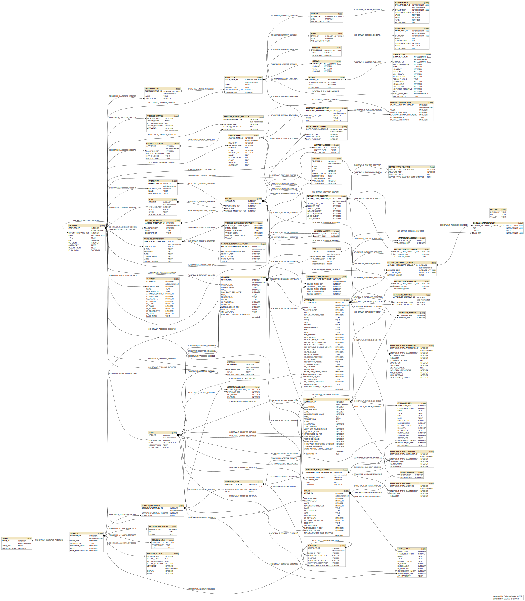

# Zigbee Advanced Platform (ZAP)

The ZAP project delivers a ZCL configuration via an "advanced configurator" and a generator platform.

- [Zigbee Advanced Platform (ZAP)](#zigbee-advanced-platform-zap)

  - [Use cases](#use-cases)
    - [Standalone electron application](#standalone-electron-application)
    - [Command line regeneration](#command-line-regeneration)
    - [Integration with IDE](#integration-with-ide)
  - [ZAP architecture](#zap-architecture)
    - [Principles](#principles)
    - [Architecture diagram](#architecture-diagram)
  - [Front end](#front-end)
  - [Generator and backend](#generator-and-backend)
  - [Database schema](#database-schema)
    - [Schema design principles](#schema-design-principles)
    - [Schema diagram](#schema-diagram)
  - [Embedded code](#embedded-code)
    - [Database](#database)
    - [Metalayer](#metalayer)
    - [Zap API](#zap-api)
  - [Versioning and backwards compatibility](#versioning-and-backwards-compatibility)
    - [Compatibility considerations](#compatibility-considerations)
    - [Dealing with the generation variant](#dealing-with-the-generation-variant)
    - [Dealing with the XML files](#dealing-with-the-xml-files)
  - [Dealing with multiple zap tool versions](#dealing-with-multiple-zap-tool-versions)
  - [Documentation](#documentation)
  - [Testing](#testing)

## Use cases

This chapter lists the use cases that were envisioned for the ZAP
platform.

### Standalone electron application

In this scenario, the zap application is used standalone. It provides a `zap` executable, which, when launched without any argument shows the full UI, which allows the user to work with an application configuration, load/save configuration files and perform a generation out of the given configuration.

### Command line regeneration

The command-line case features the same `zap` executable, however it will support command line options, such as `zap -generate <input>` which will cause the application to run in a headless mode, and generate all the data out of the configuration without showing the UI.
This will make the application well suited for integration into continuous integration tools, such as a build system like Jenkins.

The zap tool is specifically design to support such a use case, as history shows that integration into CI process is critical for adoption of the tools into a wider ecosystem.

### Integration with IDE

A third use case is an integration into IDE. There are 2 integrations currently envisioned:

- Integration with [VSCode](https://code.visualstudio.com/).
- Integration with [Silicon Labs Simplicity Studio](https://www.silabs.com/products/development-tools/software/simplicity-studio).

The integration with IDE has 2 parts:

1. Visual integration, which enables using the UI directly inside a given IDE:
   - VSCode naturally assimilates the web technology, since it is itelf written using electron. So the UI will fit naturally into its extensions model.
   - Simplicity Studio provides jxbrowser for the integration, so it will use a jxbrowser based eclipse editor to show the UI.
2. Generation integration, which enables automatic regeneration of the generated files when the configuration data changes.
   - VSCode will provide an JS-based extension, that will be able to trigger the generation code. There is no plan to move generation code in-process with the VSCode, it will be used as an independent program to execute with the correct arguments.
   - Simplicity Studio adapter pack technology will provide integration with the zap program for the generation.

## ZAP architecture

### Principles

The ZAP architecture follows the standard guidelines for modern application development using node.js for backend and web technologies for frontend.
The state of the application is stored in the back-end SQL database (initialy a [SQLite](https://www.sqlite.org/index.html) file on a desktop PC).

All the frontend is developed using the [quasar framework](https://quasar.dev/), which is one of the primer front-end frameworks developed on top of the [Vue.JS platform](https://vuejs.org/).

Between the front-end and the back-end is the REST API, which allows for an reasonable separation between the two.

The architectural design allows for the front-end user interface to be executed in any browser. The browser can be:

- [standalone chrome browser](https://www.google.com/chrome/), pointing to a specific URL
- [electron](https://www.electronjs.org/) renderer process, containing a chromium engine
- other browser environment, such as [jxbrowser](https://www.teamdev.com/jxbrowser), which is a java-based wrapper around chromium engine, used by some IDEs to embed web-based UIs into its native environment.
- any other browser environment that supports modern JS and is generally compatible with current standards

### Architecture diagram

## Front end

Front-end of the "Zap" platform centers around the UI that replaces the current ZCL tab inside SimplicityStudio's AppBuilder. The following are the architectural guidelines:

- The UI is written using standard HTML5 technologies, using Vue.JS and Quasar as an agreed-on UI framework.
- The UI backing data are the ZCL XML files for static meta-data (shipped by SDK) and the customer-owned "zcl.config" file where customer data is saved (JSON)
- The UI must not be tied to either electron or jxbrowser APIs, and should be usable in a plain chrome browser environment, to ensure portability at the JS level,
- The UI uses a common API that ties it to jxbrowser/electron/plain-browser environments via separate JS API layers for each environment, as described in "UI technologies for Wireless Tools"
- The front-end can exist as external resources, as far as Studio is considered. It is based on loading a single toplevel HTML file (or external URL) and resolving relative URLs thereon, therefore the jxbrowser environment should be able to load it from the SDK if required, with minimal bridging access mechanism for file access.
- The development environment for the the UI does not require the eclipse IDE, you can natively develop this using any standard webtech IDEs, such as vscode, atom, etc., so the entry point is much more light weight. This is very important, since in case of inexperienced developers, such environment has a much lower learning curve and allows for a much quicker contribution for resources well versed with webtech, but not with the eclipse/SWT development environment.
- The initial custom-facing release requires that the Zap UI runs inside jxbrowser, as an eclipse editor inside full-blown legacy Simplicity Studio environment
- additionally, the same UI will also be available for developers for use from command line via a simple "zclconfig <file>" command line execution, which will launch a simple electron-based app showing the exact same UI. User will be able to edit file, save changes and then proceed via command-line UC/UP generation/build process as defined by the UC/UP project.

## Generator and backend

The Zap back-end is a node.js application. The general design guidelines for the back-end logic are:

- fully embrace and make use of the asynchronous node.js callback model, thus ensuring least-blocking and maximum-performing infrastructure.
- use npm as a package manager.
- During the development process, decide on the packaging model and how we distribute node runtime to the final environment.
- Provide unit testing infrastructure, and a CI build that reacts on the code modifications automatically.

Generator is closely tied to the changes in the embedded layers, but here we list mostly integration requirements:

- Input to generator are:

  - ZCL XML files
  - generation template files
  - custom owned zcl.config file.
  - custom generation template files

- Output from generator are generated .c/.h files that the embedded code requires and a series of "generation instructions" that are the contributions to the Universal Configurator / Unified Platforom (UC/UP) project model (such as: headers defined, additional C/H files included, etc, etc.).

- Generator will be packaged as a Simplicity Studio adapter pack, which ensures that it can be executed both from command-line without any studio present, as well as from full-blown Studio or whatever subset of Studio UC command-line ends up being.

- A format of the output "generation instructions" yaml file (as described here: Advanced Configurator Generation Layer integration) will have to be agreed on with the Studio team.

- For faster generation, in environments where an intermediate yaml file is NOT required, as both driver and driven processes are within the same process in memory, the generator could use a provided interface to populate generation instructions, instead of an intermediate yaml file.

- Generator is not tied to the front-end in any way. We could, as a convenience, add a "preview mode" in the front-end UI, just to see what will generate, but the intent is to keep these decoupled and editing of the zcl.config file in a an editor is a separate process from generating content.

## Database schema

Back-end middle-layer is kept stateless, and all the data is kept in a relational database.

### Schema design principles

Following are the rules for the database schema:

- Columns with the `_ID` postfix, are the primary key columns and should be declared as such in the schema.
- Columns with the `_REF` postfix, are the foreign key columns, and should be constrained as such in the schema.
- We should support `cascade delete` mechanism for tables with foreign keys.
- All the primary keys are considered NON PERMANENT. What this means, is that between two runs of the application, there is no guarantee that these rows will survive, since the application always needs ability to start from a state where there is no database, and it will create one on the fly. This rule implies, that any exports (such as the configuration file saved to a local filesystem) _MUST NOT_ contain any references to the specific primary key values.

### Schema diagram

Following picture shows the schema diagram. Note that the root information for the schema itself, is the [SQL script that creates the schema](src-electron/db/zap-schema.sql).

_Developer note_: If there are any changes to the SQL script, the picture should be regenerated via the `docs/make-schema-diagram` script.

## Embedded code

### Database

We need to develop a common database layer that will be used across both Thread, CHIP and Zigbee or any other underlying platform. We should investigate both current options and come up with the best solution for both.

The database needs to support:

- **singleton attributes**: the attributes that have same value across multiple endpoints.
- **flash-saved attributes**: the attributes whose value is saved to flash for persistence across resets.
- **external attributes**: the attributes whose value is not stored anywhere, but whenever the code queries them, the value is received or stored via a customer callback.
- **manufacturer-specific attributes and commands**: schema needs to make sure all manufacturer specific data has place in the tables
- **external APIs**: that might allow other data tokens to be stored into this database for any purpose customers might come up with

The database design should be ZCL-independent, but should be developed as just-a-database, useful for storing anything. ZCL is a special case that uses this database. It should build into a library that should also compile on POSIX and be fully unit-testable on a Linux box.
It is also possible to reuse an existing embedded database for this purpose.

The access to the database should be done with a well defined API, so the rest of the ZCL application layer should be able to the transplanted from one to another databse. In a case of a desktop-application (for unit testing, for example), and use on Android devices, using sqlite database might make a lot of sense.
The APIs should be cleanly separated, so that migrating application layer from embedded database onto a sqlite file should be possible.

### Metalayer

The metalayer is the struct/spec layer that was created for Thread. In zigbee, there is no concept of a "command struct". Commands are parsed from a packet payload and then passed around as long list of function arguments, which is unwieldy and confusing. For Thread, Richard created a layer where each command from XML files, is generated into a struct that will be populated by the code and the spec which is a chunk of metadata used to populate the struct. Once the struct is created, a pointer to this data is passed around the functions as a single pointer, which is much more handy. We should create a single metalayer, probably copying the Thread model, and then retrofit Zigbee code with it.

Zigbee metalayer should be a library, built and fully unit-testable on a Linux environment.

### Zap API

Zap implements the clusters in a form of "plugins". Each cluster server or client implementation will typically be a separate plugin.
In order for these plugins to me interchangeably used on top of any transport layer or underlying stack implementation, the code in them is NOT allowed to use any underlying stack or RTOS APIs.
They are only allowed to use the Zap API, which will be defined for this purpose.

There will be multiple actual implementations of Zap API:

- **mock implementation**: pure stubs, do nothing, just allows a compile to succeed without any underlying layers.
- **Silabs Zigbee implementation**: implementation that binds the zap library with the Silicon Labs Zigbee Pro stack.
- **Posix implementation**: POSIX based C code implementation, used in enhanced unit tests and simulation runs.
- **CHIP implementation**: Implementation of the API on top of CHIP OpenWeave stack.

Zap API will provide functions in roughly following categories:

- **network abstraction layer**: abstractions for basic interaction with sending and receiving packets
- **payload codecs**: abstractions for encoding and decoding payload into the ZCL structures.
- **OS abstraction layer**: abstractions for any kind of RTOS or lower level services, such as event management, memory allocation, etc., required by the plugin code.
- **DB abstraction layer**: abstractions to access embedded attribute database for storage of ZCL attributes or other tokens.

## Versioning and backwards compatibility

Zap infrastructure needs to be able to deal with the use case, where a user has multiple ZCL data packs installed and at the same time, the user may have multiple projects (either in IDE, or outside of it) opened simultaneously against one or more ZCL data packs.

The tool rules that deal with multiple ZCL data pack versions are as follows...

### Compatibility considerations

Zap tools follows the following strict rules of backwards compatibility:

- Each version of the tool, can read the `zcl.config` files created by itself, or by any older version of zap tool.
- It might not be able to read `zcl.config` file saved by future versions of the zap tool.
- Each version of the tool, writes out only its own versions of the zcl.config files. This means that any time you read in a config file, and save it back out, it means it gets upgraded to the latest format.
- Each version of the tool, can generate artifacts for its own version, or any older version of the SDK. The information about which generation variant is required, is saved in the zcl.config file.

Consequences of these rules:

- Once you have an upgraded version of the zap tool in your desktop environment, you should never downgrade.
- If you have mutiple versions of the zap tool in your desktop environment, you should always execute the latest, and can safely delete all earlier versions.

### Dealing with the generation variant

Zap tool supports multiple variants of generation. Different versions of the SDK might require different variant. Variants are identified by an increasing integer number, starting with zero.

- A desired variant of generation is recorded in the zcl.config file.
  Generation logic inside Zap tool is separated per-variant, so that each variant generator is isolated in a separate javascript module.
- An initial variant is populated from the initial template of zcl.config file, that is copied into your project from the selection of the zcl component.
- Technically, users can always change the variant inside zcl.config file. But the user interface should not allow them to do that easily, since changing a variant makes no sense within a same ZCL data pack.
- Upgrading the zcl.config file from one SDK to another, where a generation variant has increased, will result in the variant inside zcl.config file being upgraded.
- As each version of zap tool, supports current and all older variants, you can always generate older variant projects from latest version of the tool.

### Dealing with the XML files

Zap tool needs to be able to read in and parse the XML files from all installed locations on demand, and hash them internally per SDK.

When zap tool is asked to serve UI, or generate, it will require information which set of XML files to use. This information can be provided via a parameter to the tool. The driving entity (IDE?) will be able to pass that information to the zap program. Zap tool itself, will not be aware of a concept of SDK, beyond just keeping track of different directories where the XML files are present, so it can load them in as needed.

## Dealing with multiple zap tool versions

Following rules apply:

- There is ALWAYS only one copy of the zap tool running. There is never a valid reason, nor should be allowed, to execute two versions of the zap tool in any normal flow. Zap tool will create a taskbar icon which will be an interface for the user to interact with the tool globally, without the context of the specific zcl.config file.
- If the currently running version of the zap tool encounters a generation variant that is higher than the one it supports, or zcl.config file in a format higher than is supports it shows an error and prompts to upgrade the tool.
- When a zap tool opens a zcl.config file, it will create a "session" for this zcl.config file. In case of UI, there will be a cookie on a browser side identifying the session. This way, you can open multiple browser windows against the same zap tool back-end to edit multiple files.
  Each "session" will know the following information:
  - the user data that it is processing (the in-memory or in-database equivalent of the zcl.config file).
  - the static SDK data (ZCL XML files) that match this user data, which is provided from the cache of all loaded XML files as described in the previous chapter.
  - Sessions may be persisted and/or removed from in-memory representation due to inactivity. Final specific implementation TBD.

Zap tool will be versioned with 2 tokens of information. These versions will be seen via a --version command line argument and they will be saved into the zcl.config file. The two tokens are:

- The git commit # of the built version of tool.
- A date of this git commit in a human readable form.

There is no plans to give a zap tool any other version, such as "1.0.0" or "2.4.5" or something like that, since those would essentially just serve as obfuscated aliases to retrieve the two tokens mentioned before. If someone desires to build an 3-digit compliant version of the zap tool version (for example, in case where it needs to be packaged as an eclipse plugin or something, should we decide to distribute it that way), then the 3-digit version would be YEAR.MONTH.DAY of the git commit date.

This might change in the future if there is a need for a clear marketing
version of the product.

## Documentation

There are following aspects to the documentation of this project.

The markdown formatted documents are commited in the repo, since the markdown format is easy to read in github. Following are the markdown formatted pieces of documentation:

- hand-written markdown documents (such as this design document you're reading now)
- generated Javascript API documentation from jsdoc comments in the code.
- generated REST API documentation from jsdoc comments in the code.

Besides the markdown, there is also a process to generate HTML documentation out of jsdoc and md files. The HTML documentation is not intended to be commited to git, but should be generated on the fly by the zap CI process.

## Testing

Unit testing was an extremely important for ZCL embedded apps, therefore the scope of existing unit tests needs to be maintained. Exact design TBD.
