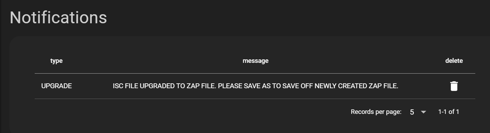
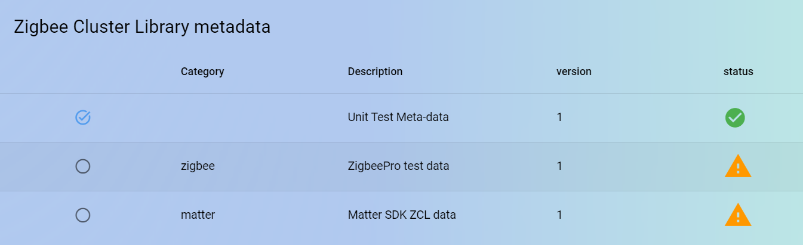
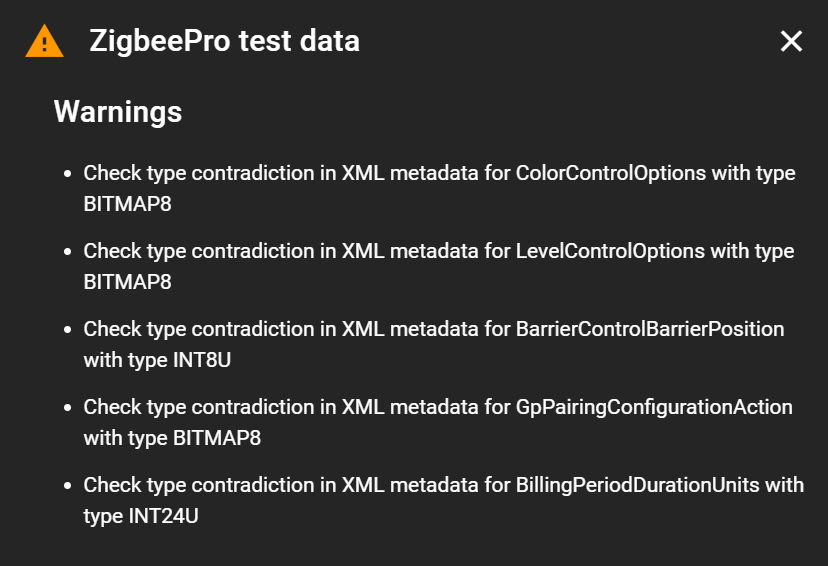
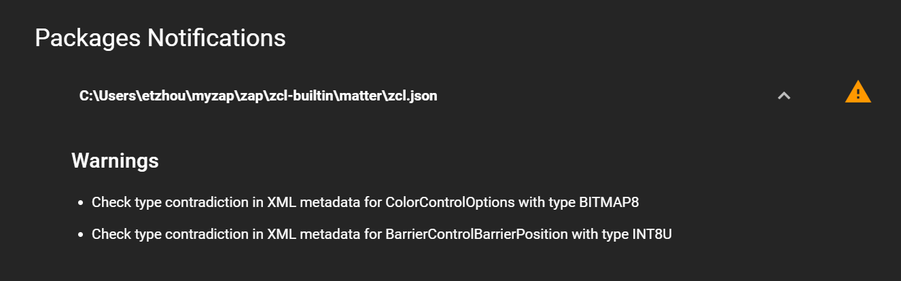

# Notification Development Instructions

The purpose of this document is to provide ZAP developers with simple instructions on how to add a notification.

## Adding a Notification:

### Adding a Session Notification

Session notifications are set after a session is created. To add a session notification, call the setNotification function in zap/src-electron/query-session-notification.js.
setNotification takes the following arguments:

- db => database object (object)
- type => the type of notification you wish to define (string)
  - options
    - ERROR
    - WARNING
    - UPGRADE
- status => the message of the notification (string)
- sessionId => the session Id (integer)
- severity => representation of importance (integer)
  - options
    - 1 => high (ERROR type)
    - 2 => medium (default, WARNING type)
    - 3 => low
- display => method to notify the user (integer)
  - options
    - 1 => display a pop-up message
    - 0 => do not show a pop-up message

For example,

```
async function iscDataLoader(db, state, sessionId) {
  let endpointTypes = state.endpointTypes
  let promises = []
  await querySessionNotification.setNotification(
    db,
    'UPGRADE',
    'ISC FILE UPGRADED TO ZAP FILE. PLEASE SAVE AS TO SAVE OFF NEWLY CREATED ZAP FILE.',
    sessionId,
    1,
    0,
  )
}
```

- When calling the setNotification function, ensure a valid session Id is accessible within the current scope

- For testing you can navigate to **zap/src/pages/NotificationPage.vue**, which queries the SESSION_NOTICE table and returns all notifications with the same SESSION_REF.

For example, the picture below is the result of importing an isc file in the notification page.



### Adding a Package Notification

Package notifications are set when processing and loading a specific package. To add a package notification, call the setNotification function in zap/src-electron/query-package-notification.js.
setNotification takes the following arguments:

- db => database object (object)
- type => the type of notification you wish to define (string)
  - options
    - ERROR
    - WARNING
    - UPGRADE
- status => the message of the notification (string)
- packageId => the package Id (integer)
- severity => representation of importance (integer)
  - options
    - 1 => high (ERROR type)
    - 2 => medium (default, WARNING type)
    - 3 => low

For example,

```
function prepareEnumOrBitmap(db, packageId, a, dataType, typeMap) {
  let message = 'Check type contradiction in XML metadata for ' +
  a.$.name + ' with type ' + a.$.type
  env.logWarning(message)
  queryPackageNotification.setNotification(
    db,
    "WARNING",
    message,
    packageId,
    2
  )
}
```

- When calling the setNotification function, ensure a valid package Id is accessible within the current scope

- For testing you can navigate to **zap/src/pages/ZapConfig.vue** which queries the PACKAGE_NOTICE table and returns all notifications from packages referenced by the current session.

For example, in the pictures below, clicking the warning icon will lead you to a dialog showing all notifications for that package.





**zap/src/pages/NotificationPage.vue** will display all notifications from packages chosen or imported by the user, like shown in the picture below


