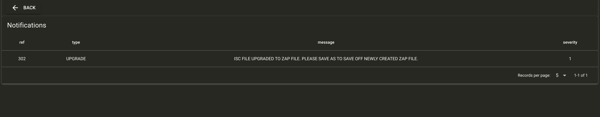

# Notification Development Instructions

The purpose of this document is to provide ZAP developers with simple instructions on how to add a notification.

## Adding a Notification:

In order to add a notification, call the setNotification function in zap/src-electron/query-session-notification.js. setNotification takes the following arguments:

- db => database object (object)
- type => the type of notification you wish to define (string)
  - options
    - UPGRADE
    - WARNING
    - ERROR
- status => the message of the notification (string)
- sessionId => the session Id (string)
- severity => representation of importance (integer)
  - options
    - 1 => high
    - 2 => medium (default)
    - 3 => low

For example,

```
async function iscDataLoader(db, state, sessionId) {
  let endpointTypes = state.endpointTypes
  let promises = []
  await notification.setNotification(
    db,
    'UPGRADE',
    'ISC FILE UPGRADED TO ZAP FILE. PLEASE SAVE AS TO SAVE OFF NEWLY CREATED ZAP FILE.',
    sessionId,
    1
  )
```

- For testing you can navigate to **zap/src/NotificationPage.vue** which queries the SESSION_NOTICE table and returns all notifications with the same SESSION_REF.

For example, the picture below is the result of importing an isc file.


