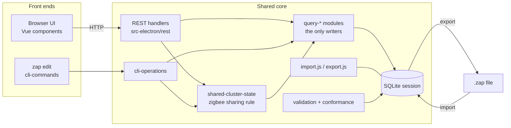
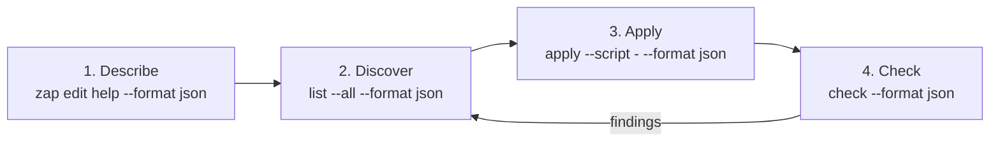
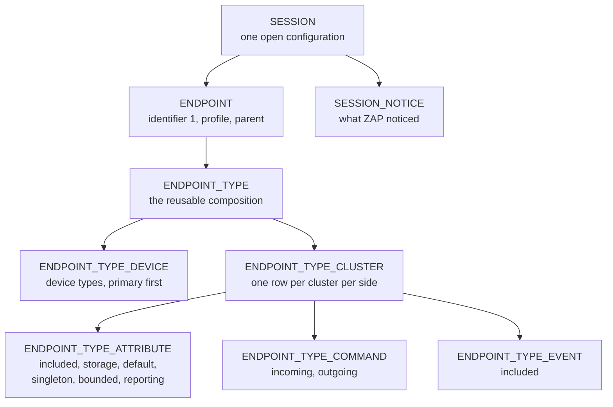
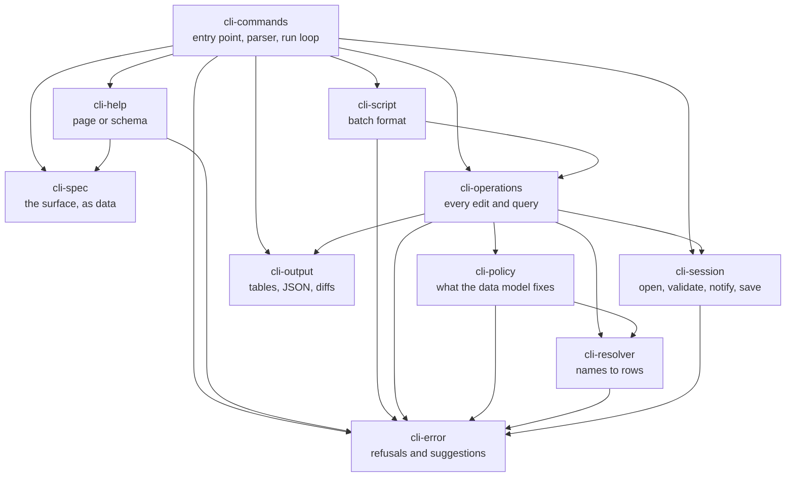
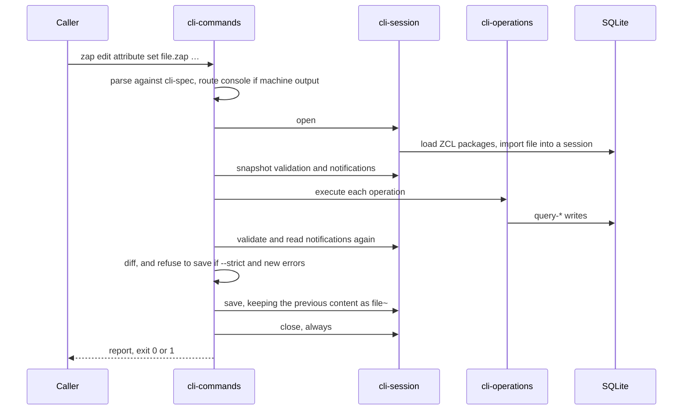
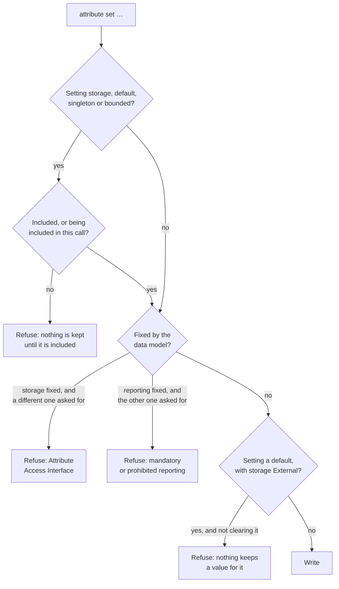

# The `zap edit` CLI: architecture

This is the architecture of the `zap edit` command-line tool — not the browser
editor. It performs, from a terminal, the edits the ZAP user interface performs
in a browser: creating endpoints, composing them, enabling clusters, and
configuring attributes, commands, events and Matter features. It is not a second
implementation of those edits. It is a second front end onto the one that already
exists.

Two audiences shaped it. People need short commands, names that work the way they
are spoken, and errors that say what to do next. Programs — increasingly, AI
agents — need something stricter: a surface they can read, output they can parse,
and a guarantee that a change reported as made was made. Part I is about the
second audience, because that is the part of the design that is least obvious.
Part II is how the whole thing works.

| If you are                              | Start at                                                                                      |
| --------------------------------------- | --------------------------------------------------------------------------------------------- |
| Deciding whether to approve this        | [1. In one page](#1-in-one-page), then [Part I](#part-i--designed-for-agents)                 |
| Writing an agent or a script against it | [Part I](#part-i--designed-for-agents), then [§13 edge cases](#13-edge-cases)                 |
| New to ZAP                              | [§6 ZAP in five minutes](#6-zap-in-five-minutes) before anything else                         |
| Maintaining ZAP                         | [§7 modules](#7-the-modules) onward, and [§14 notes for the expert](#14-notes-for-the-expert) |

**Contents**

- [1. In one page](#1-in-one-page)
- [Part I — Designed for agents](#part-i--designed-for-agents)
  - [2. What an agent cannot do](#2-what-an-agent-cannot-do)
  - [3. The commitments, and what implements each](#3-the-commitments-and-what-implements-each)
  - [4. The four-call loop](#4-the-four-call-loop)
  - [5. What this does not solve](#5-what-this-does-not-solve)
- [Part II — How it works](#part-ii--how-it-works)
  - [6. ZAP in five minutes](#6-zap-in-five-minutes)
  - [7. The modules](#7-the-modules)
  - [8. The life of one invocation](#8-the-life-of-one-invocation)
  - [9. Turning words into rows](#9-turning-words-into-rows)
  - [10. The guardrails](#10-the-guardrails)
    - [10.1 Clusters that more than one endpoint shares](#101-clusters-that-more-than-one-endpoint-shares)
  - [11. Compliance: validation and notifications](#11-compliance-validation-and-notifications)
  - [12. Writing the file](#12-writing-the-file)
  - [13. Edge cases](#13-edge-cases)
  - [14. Notes for the expert](#14-notes-for-the-expert)
  - [15. How it is tested](#15-how-it-is-tested)
  - [16. Extending it](#16-extending-it)
  - [17. Limitations](#17-limitations)
- [Appendix A — module inventory](#appendix-a--module-inventory)
- [Appendix B — the schema an agent reads](#appendix-b--the-schema-an-agent-reads)

---

## 1. In one page

ZAP's editing model is simpler than it first appears. A `.zap` file is not the
working state; it is a projection of one. Opening a file imports it into a
**session** in a SQLite database, every edit is a row change in that session, and
saving projects the session back out. The user interface is a browser onto a
session over HTTP. `zap edit` is the same session without the browser.



Everything follows from that picture:

- **Correctness comes from reuse.** The CLI writes through the same `query-*`
  functions the REST layer calls, so database triggers, defaults and side effects
  behave identically whichever front end asked. There is no parallel write path
  to keep in step.
- **The CLI's own code is about the terminal**, not about ZCL: parsing, resolving
  names to rows, deciding what to refuse, and rendering results.
- **Ten modules, one direction.** No module depends on one that depends on it.

By the numbers: 7 operation groups, 27 operations, 22 global options, ~5,700
lines under `src-electron/cli`, and 65 tests in `test/cli-edit.test.js`.

---

## Part I — Designed for agents

### 2. What an agent cannot do

The user interface prevents mistakes visually. A control that must not be changed
is greyed out; a count in the toolbar rises when something needs attention; a
name is chosen from a list, so it is never misspelled. None of that survives the
trip to a terminal, and an agent is exactly the caller that cannot compensate for
its absence.

Five concrete limits, and what each demands of the tool:

| An agent cannot…                                    | So the tool must…                                                         |
| --------------------------------------------------- | ------------------------------------------------------------------------- |
| See that a control is greyed out                    | Refuse the change in words, and say what the constraint is                |
| Notice that a value it set came back different      | Never report a write that the next read undoes                            |
| Know the vocabulary of a data model it has not read | Accept the names it plausibly has, and answer a miss with the near misses |
| Read a manual page reliably                         | Describe its own surface in a form that parses                            |
| Undo half of a batch                                | Apply all of a batch or none of it                                        |

None of this is exotic. It is the same discipline good command line tools have
always had. Agents just make the cost of getting it wrong immediate: a human who
sees `storage=RAM` printed and `External` in the file will investigate; an agent
will build ten more edits on top of the false belief.

### 3. The commitments, and what implements each

#### 3.1 The surface describes itself

`cli-spec.js` holds the entire command surface as data: groups, operations, their
options, types, defaults, which operations only read, plus notes, discovery
recipes and examples. Two consumers read it. `cli-commands.js` builds the yargs
parser from it, and `cli-help.js` renders it — as a page for a person, or as JSON
for a program:

```bash
zap edit help --format json     # every operation, every option, with types
```

Because both come from one declaration, the parser and the help cannot disagree.
A test asserts that the operations described are exactly the operations
implemented, so an operation cannot be added without becoming discoverable, and
help cannot advertise something that does not run.

The schema is deliberately shallow — `operation`, `command`, `options[]`,
`readOnly`, `takesFile` (see [Appendix B](#appendix-b--the-schema-an-agent-reads)).
An agent needs to know what to send, not how ZAP is built.

#### 3.2 Standard output is a data channel

`--format json` prints one object: an entry per operation with its messages and
any rows, plus `savedTo`, `validation` and `notifications`. For that to be worth
advertising, stdout has to carry the payload and nothing else — and ZAP's loading
path prints progress and specification warnings through `console.log` from
several modules that have no idea a machine is reading. So for the duration of a
machine-readable run, `console.log` is pointed at stderr. Nothing is lost; it
stops corrupting the payload. `--quiet` does the same for text runs.

Shapes stay stable rather than convenient: a listing that finds nothing still
reports `rows: []`, and `check` on a clean configuration reports an empty list of
findings rather than no list at all. Code paths that only sometimes exist are the
ones agents break on.

Exit codes are two: `0` for success, `1` for failure with the reason on stderr.

#### 3.3 Refuse rather than pretend

This is the commitment with teeth, and it is worth one example. In the Matter
data model, some attributes are served through the Attribute Access Interface:
their value lives in application code, so their storage is fixed at External.
Before this rule was applied, `attribute set --storage RAM` on `Access Control /
ACL` printed `storage=RAM` and exited 0 — and the file, read back, said
`External`, because ZAP re-applies the policy on every import. The write never
existed.

The CLI now reads the same policy the interface reads and refuses:

```
ERROR: Attribute ACL on Access Control/server of endpoint 1 is served through the Attribute Access Interface
   Its storage is fixed at External, which is why the user interface
   greys the choice out: the value lives in application code rather than in
   an attribute store. Drop --storage, or pass --storage External.
```

Three properties make that message usable by a program as well as a person: it
names the subject precisely, it gives the reason, and it ends with the flags that
would work. [§10](#10-the-guardrails) lists the full set of rules. The same
principle governs saving: an edit that could not survive a save is refused with
the command that would make it possible, never reported as done.

#### 3.4 Names as the caller has them

An agent takes names from a specification, a header file, or another `.zap` file,
where the same cluster appears as `On/Off`, `ON_OFF`, `onoff` or `0x0006`. All
four resolve to the same cluster: matching ignores case and punctuation, and a
number is read as a code. When nothing matches, the answer ranks the plausible
candidates by edit distance rather than dumping the catalogue, and an ambiguous
name is reported as ambiguous rather than resolved by luck
([§9](#9-turning-words-into-rows)).

#### 3.5 All or nothing

`zap edit apply` reads a list of operations from YAML or JSON — a file, or stdin
with `--script -` — and applies them in one pass against one session. If any
operation fails, nothing is written: the failure happens before the export, so
the file on disk is byte-identical. A test asserts exactly that. `--dry-run`
applies everything and reports, writing nothing at all.

Batching is also the answer to the tool's main cost. Loading ZCL metadata
dominates an invocation, so ten commands pay it ten times and one `apply` pays it
once.

#### 3.6 Report the consequences, not only the action

Every mutating run reports two things beyond its own result.

**Validation** re-derives the specification requirements from the current state:
malformed endpoints, defaults out of range, mandatory clusters, attributes and
commands, and elements a cluster's feature selection requires or forbids.

**Notifications** are what ZAP noticed while reading and editing — a provisional
cluster in use, a command whose response command is not enabled, a duplicate, a
device type no longer in the metadata. Nothing recomputes these; several are
written by database triggers as rows change. They are the count the interface
shows in its toolbar.

Both are reported as diffs, because a configuration usually carries findings that
predate the current edit and listing all of them buries the one line that
matters:

```
Enabled command EnhancedAddScene (0x40) in on Scenes of endpoint 3
Validation: no new issues (2 pre-existing warning(s))
Notifications: 1 new (10 pre-existing)
  warning: On endpoint 3, cluster: Scenes server, outgoing command:
  EnhancedAddSceneResponse should be enabled as it is the response to the
  enabled incoming command: EnhancedAddScene.
```

Doing what it says reports `1 resolved` — so an agent can tell that its remedy
worked, which is the harder half of the loop. `--strict` refuses to save when the
edit introduced errors, ignoring pre-existing ones.

Finally, each result carries what usually comes next, built from the
configuration in hand so it runs as printed, and never proposing to undo
something mandatory. In JSON these arrive as `nextSteps`.

#### The commitments in one table

| Commitment                       | Mechanism                                   | Lives in                               | Guarded by                                        |
| -------------------------------- | ------------------------------------------- | -------------------------------------- | ------------------------------------------------- |
| Self-describing surface          | One declaration, two consumers              | `cli-spec`, `cli-help`, `cli-commands` | Test: described operations == implemented ones    |
| Parseable output                 | JSON report; `console.log` routed to stderr | `cli-output`, `cli-commands`           | Test: stdout is pure JSON                         |
| No phantom writes                | Data model policy checked before writing    | `cli-policy`, `cli-operations`         | Tests per rule, plus a unit test of the rules     |
| Forgiving names, honest failures | Normalized matching, ranked candidates      | `cli-resolver`, `cli-error`            | Tests: suggestions are runnable and safe          |
| Atomic batches                   | One session, export last                    | `cli-commands`, `cli-script`           | Test: failed batch leaves the file byte-identical |
| Consequences reported            | Validation and notification diffs           | `cli-output`, `cli-session`            | Tests: new, pre-existing and resolved counts      |

### 4. The four-call loop

An agent that has never seen this tool needs four kinds of call. Only the first
is fixed knowledge; the rest are derived from the answers.



1. **Describe** — the operations and their parameters.
2. **Discover** — the values this configuration accepts: which device types and
   clusters exist, what is already on an endpoint, how each attribute is
   configured, and which of its fields are fixed. The schema ships these recipes
   in its `discovery` section, so the agent does not have to invent them.
3. **Apply** — one batch, atomically.
4. **Check** — `zap edit check` reports validation findings and notifications for
   the file as it stands, changing nothing, and with `--strict` exits non-zero
   when there are errors. Findings name the endpoint, cluster and element, which
   is enough to plan the next batch.

The loop closes because step 4 produces the input to step 2. That is the whole
premise: an agent should be able to work from the tool's own answers, not from
this document.

### 5. What this does not solve

- **There is no session between calls.** The file is the state. Two agents
  editing one file will not see each other's work, and the last save wins.
- **Metadata loading dominates the runtime**, which is why one `apply` beats ten
  commands. The database in the state directory is reused as a cache across
  invocations, keyed by package checksum.
- **Suggestions are conventions, not a planner.** They propose the next
  reasonable step, not the shortest path to a goal.
- **The schema describes shape, not legality.** Which device types or clusters a
  particular configuration accepts comes from discovery calls against that
  configuration, because it depends on the metadata loaded.
- **Conformance is evaluated, not inferred.** Expressions ZAP's evaluator cannot
  process — anything resting on `desc` — are reported as needing human judgement
  rather than guessed at. The interface behaves the same way.
- **Nothing here validates intent.** A configuration can be perfectly valid and
  still not the product you meant to build.

---

## Part II — How it works

### 6. ZAP in five minutes

_If you already know ZAP, skip to [§7](#7-the-modules)._

**Packages** are the inputs that define the world: ZCL metadata (`zcl.json` and
the XML it names) describing clusters, attributes, commands, events, device types
and Matter features, plus generation templates. Loading a package parses it into
read-only tables — `CLUSTER`, `ATTRIBUTE`, `COMMAND`, `EVENT`, `DEVICE_TYPE`,
`FEATURE`. Nothing about your product is in there.

**A session** is your product: the editable state, and the only thing an edit
touches.

The join that confuses everyone once is between three tables:



- An **endpoint** is the numbered thing in generated code. `--endpoint 1` always
  means that number, never a database row id.
- An **endpoint type** is the composition behind it. Two endpoints can share one,
  which is why deleting an endpoint only removes its endpoint type when nothing
  else uses it.
- An **endpoint type cluster** exists _per side_. `On/Off` server and `On/Off`
  client are two rows, and every attribute, command and event row hangs off one
  of them. This is why `--side` matters, and why enabling a cluster on the wrong
  side quietly gets you nothing.

**Device types** are templates. Adding one enables the clusters, attributes and
commands it requires — which is why `endpoint create --device-type` does most of
the work for you.

**Matter features** are bits of a cluster's `FeatureMap` attribute value. There
is no separate feature table in a session: the selection _is_ that attribute's
value, so excluding the attribute discards the selection.

**Conformance** is the specification's rule for whether an element is mandatory,
optional, provisional, disallowed or deprecated, sometimes as an expression over
other elements (`[LT]`, `[!(LT | DF)]`). A device type's conformance for a feature
overrides the cluster's, and is usually stricter.

**A `.zap` file** is the session projected out. Saving normalizes: unselected
elements are dropped, and mandatory ones the metadata requires are added. Every
tool that loads and saves a `.zap` file does this, `zap convert` included.

| Term             | Means                                                            |
| ---------------- | ---------------------------------------------------------------- |
| Package          | ZCL metadata or a template set, loaded into read-only tables     |
| Session          | The editable configuration                                       |
| Endpoint         | The number in generated code                                     |
| Endpoint type    | The composition an endpoint points at                            |
| Side             | `client` or `server`; clusters and their elements exist per side |
| Included         | An attribute or event is part of the configuration               |
| Storage option   | `RAM`, `NVM` or `External` — where an attribute's value lives    |
| Storage policy   | The data model's rule about that choice                          |
| Reporting policy | The data model's rule about attribute reporting                  |
| FeatureMap       | Attribute `0xFFFC`, whose bits are the feature selection         |
| Notification     | Something ZAP noticed, recorded on the session or the package    |

### 7. The modules

Ten modules under `src-electron/cli`, in one direction only.



| Module           | Responsibility                                                 | Why it is separate                                    |
| ---------------- | -------------------------------------------------------------- | ----------------------------------------------------- |
| `cli-spec`       | The command surface as data                                    | So the parser and the help cannot drift apart         |
| `cli-help`       | Renders the surface                                            | Text and JSON are presentation, not policy            |
| `cli-commands`   | Parses, orders the run, decides the exit code                  | The only module that knows about process concerns     |
| `cli-session`    | Open a file into a session, validate, read notifications, save | Isolates the lifecycle from what the edits are        |
| `cli-operations` | The 27 operations                                              | The one place a `.zap` file is changed                |
| `cli-resolver`   | Names, codes and categories into rows                          | Used by operations and by policy; independent of both |
| `cli-policy`     | What the data model fixes, and how to say so                   | Rules worth testing on their own                      |
| `cli-script`     | Loading and normalizing a batch                                | Keeps parsing YAML out of the run loop                |
| `cli-output`     | Tables, JSON, and the two diffs                                | No knowledge of ZCL; pure rendering                   |
| `cli-error`      | `CliError`, plus ranked candidates                             | A leaf, so anything may refuse                        |

Three rules hold this together, and each is checked rather than trusted:

1. **Only `query-*` writes.** No module here issues SQL. Every change goes
   through the functions the REST layer uses, so triggers and defaults fire the
   same way for both front ends.
2. **The dependency graph is acyclic**, and `cli-error`, `cli-spec` and
   `cli-output` depend on nothing inside the directory. A test reads the requires
   and fails if a cycle appears.
3. **Refusals are one type.** `CliError` means "the user can fix this"; anything
   else is a bug and prints as a crash. That distinction is what makes the error
   surface testable.

### 8. The life of one invocation



The order is the design:

- **Parse before anything is loaded.** `zap edit help` must not pay for metadata
  it does not use, and an invalid command line must fail before touching a file.
- **Snapshot before editing.** The only way to report what _this_ run introduced
  is to know what was there when it started. The snapshot is taken after the
  import, so findings the file arrived with count as pre-existing — which they
  are.
- **Validate after, diff, then decide.** `--strict` is a decision about saving,
  so it happens once every operation has run and before anything is written.
- **Write last, once.** One export at the end is what makes a batch atomic.
- **Close in a `finally`.** A crash mid-run must still release the database.

Read-only operations skip the snapshot, the diff and the save entirely: they cost
the metadata load and the queries the listing itself needs.

### 9. Turning words into rows

Resolution is where a command line meets a data model, and it is the part most
likely to annoy a caller, so it is deliberately generous in one direction and
strict in the other.

**Generous:** names are compared with case and punctuation removed, so `On/Off`,
`ON_OFF`, `onoff` and `on off` are one name. A value that parses as a number —
decimal or `0x` — is read as a code. Attribute `define` names work as well as
labels. Device types match on name or code.

**Strict:** when a name matches nothing, the failure lists the closest candidates
by edit distance, capped, rather than the whole catalogue. When it matches more
than one thing, that is reported as ambiguity with the matches shown; it is never
resolved by picking the first.

Three cases need more than matching:

- **An attribute that exists on both sides.** If one side of the cluster is
  enabled and the other is not, the enabled side is meant. If both are, `--side`
  is required rather than guessed.
- **Commands declared `source="either"`.** ZAP has no cluster side to record an
  outgoing direction against for these, and 71 shipped commands are declared that
  way. `--direction out` on one is refused with the reason, not with a confusing
  message about "the either side".
- **Multiprotocol configurations.** Each protocol numbers its endpoints from
  scratch, so one file can hold two endpoints called `1`. `--category zigbee` or
  `--category matter` says which; without it the operation is refused rather than
  guessed. Where only one category has that identifier, it is used.

| Input                                      | Resolves as                           |
| ------------------------------------------ | ------------------------------------- |
| `On/Off`, `ON_OFF`, `onoff`, `0x0006`, `6` | The On/Off cluster                    |
| `MA-onofflight`, `ma onofflight`           | The Matter On/Off Light device type   |
| `OnOff`, `ZCL_ON_OFF_ATTRIBUTE_ID`         | The OnOff attribute                   |
| `LT`, `Lighting`, `0`                      | A feature by code, name or bit        |
| `Levl Control`                             | Refused, with `Level Control` offered |

### 10. The guardrails

The interface expresses two different things by greying a control out: that the
data model has already decided a value, and that there is nothing there to
decide. `cli-policy` mirrors both.

**Where the rules come from.** Storage policy arrives two ways during metadata
loading: on the attribute itself (`ATTRIBUTE.STORAGE_POLICY`, set for list types
and for the attributes a Matter `zcl.json` names), and as cluster-and-attribute
pairs recorded as package options — which is why `ClusterRevision` is ordinary on
most clusters and fixed on Access Control. Reporting policy is a column on the
attribute: `mandatory`, `suggested`, `optional` or `prohibited`.

The CLI does not reinterpret any of it. It asks the same functions the interface
asks over `/zcl/forcedExternal` — `getForcedExternalStorage`,
`computeStoragePolicyNewConfig`, `computeStorageOptionNewConfig` — so the answer
cannot drift from the interface's answer. The pair list is fetched once per
session and kept.



The rules, and the reason each is a refusal rather than a warning:

| Rule                                                                | Reason                                                                          |
| ------------------------------------------------------------------- | ------------------------------------------------------------------------------- |
| Storage of an Attribute Access Interface attribute is External      | The importer re-applies it, so any other value is undone on the next read       |
| An external attribute keeps no default value                        | Its value comes from application code; the interface blanks and greys the field |
| Reporting the specification mandates or forbids cannot be moved     | The importer re-applies it too. 734 of 785 Matter attributes mandate reporting  |
| Storage, default, singleton and bounded need the attribute included | An attribute that is not included is not kept at all                            |
| A feature whose conformance is `X` or `D` cannot be selected        | There is nothing to select; the interface greys the switch                      |
| Elements of a disabled cluster side cannot be configured            | The saved format keeps only enabled clusters, so the edit would be dropped      |
| `FeatureMap` must be included to toggle a feature                   | The selection is that attribute's value                                         |

Restating a value that is already fixed is not refused — asking for
`--storage External` where External is fixed, or clearing a default that cannot
be kept, asks for nothing. Scripts that re-assert what they find should not fail.

`attribute list` reports a `fixed` column naming these per attribute, so a caller
can see a refusal coming instead of discovering it. Zigbee metadata carries no
such policy, so for Zigbee the column is empty and none of these refusals can
fire.

**Two deliberate departures**, both toward saying more rather than less. A global
attribute such as `AttributeList` carries the policy on itself and belongs to no
cluster, so the pair matching the interface uses never matches it and the choice
looks open there; the write survives no read either way, so this refuses it. And
the cluster constraints of the interface's Legal Clusters filter are a property of
the view you have chosen rather than of the configuration, so any cluster can be
enabled here, and what a device type requires is reported as a validation finding
instead.

#### 10.1 Clusters that more than one endpoint shares

The rules above are Matter's. The one that runs the other way is Zigbee's: there,
a cluster's configuration is a single global entity, so the same cluster on three
endpoints includes the same attributes with the same storage and defaults, and the
framework keeps one copy of them. ZAP's tables are per endpoint type, so that
shape is enforced rather than represented — the interface re-aligns every endpoint
after each change, over `/shareClusterStatesAcrossEndpoints`.

The CLI runs the same unification, from the same code
(`util/shared-cluster-state.js`, which the route now delegates to as well), after
the operations and before validation, so the findings describe the state that will
be saved.

Which behaviour applies is asked of the data model rather than decided by name:

| Question                          | Answer comes from                                                                    |
| --------------------------------- | ------------------------------------------------------------------------------------ |
| Is cluster state shared at all?   | The `shareClusterStatesAcrossEndpoints` generator option, which Zigbee templates set |
| Which endpoints does that cover?  | The category of the packages that declared it, matched against each endpoint's own   |
| Which endpoints are then aligned? | Those enabling a cluster that more than one of them enables                          |

That second row is what keeps a multiprotocol configuration honest. The Zigbee
endpoints of such a file share their clusters; the Matter endpoints in the same
file are left untouched, because an attribute there is genuinely per endpoint.
Symmetrically, the Matter storage and reporting policy comes only from Matter
metadata, so it cannot fire on a Zigbee configuration. Neither protocol's rule
leaks into the other.

The first row is worth testing on its own, because a rule read from the data
model and a rule guessed from a name are indistinguishable until you change the
data model. So there is a test that loads the Zigbee metadata with the option
taken out of the templates and nothing else altered: the same two endpoints, the
same cluster, and no unification. Sharing follows the declaration, not the word
"zigbee".

### 11. Compliance: validation and notifications

Two independent accounts, because they know different things.

|            | Validation                                                                                                                | Notifications                                                                                                 |
| ---------- | ------------------------------------------------------------------------------------------------------------------------- | ------------------------------------------------------------------------------------------------------------- |
| Where      | `validation/validate-all.js`                                                                                              | `SESSION_NOTICE`, `PACKAGE_NOTICE`                                                                            |
| When       | On demand, recomputed from current state                                                                                  | As things happen, during import and editing                                                                   |
| Knows      | Endpoint and network identifiers, defaults out of range, mandatory clusters, attributes and commands, feature conformance | Provisional clusters in use, missing response commands, duplicates, unknown device types, metadata complaints |
| Written by | Nobody — it is a report                                                                                                   | The importer, and database triggers                                                                           |
| Costs      | A full recomputation                                                                                                      | Two queries                                                                                                   |

Neither subsumes the other. Validation cannot know that a cluster was
provisional when it was enabled; notifications cannot recompute a conformance
expression after the feature map changed.

They do overlap in wording, though: both say a mandatory attribute is switched
off, one of them behind a warning sign and inside a longer line. So a finding is
reduced to its letters and digits before comparison, and where the two accounts
describe the same problem the recomputed one is kept. That deduplication is what
makes `check` readable:

```
light.zap: 1 error(s), 4 warning(s)
KIND     SOURCE         MESSAGE
error    validation     endpoint 1 On/Off/StartUpOnOff: Out of range
warning  validation     endpoint 1 Identify: … mandatory attribute: IdentifyType needs to be enabled
warning  configuration  On endpoint 1, support for cluster: Scenes server is provisional.
```

`source` says which account a finding came from: `validation`, `configuration`
for a notification about this file, or `data model` for one about the metadata.
The last are behind `--packages`, because a configuration cannot fix them and
there are dozens in the shipped XML.

Diffs are multiset comparisons: a finding present twice before and three times
after counts as one new one. The same comparison serves both accounts.

#### 11.1 Why the interface agrees about all of it

A notification is never written into the `.zap` file. That sounds like a gap
for a headless editor and is the opposite: because nothing is persisted, there
is no cached copy for the two front ends to disagree about. A notification
exists for as long as a session does, and it gets there in one of three ways,
all of them below the REST layer:

| Raised by                                    | When                                                   | Example                                                   |
| -------------------------------------------- | ------------------------------------------------------ | --------------------------------------------------------- |
| Triggers in `zap-schema.sql`                 | As a cluster, attribute or command state is written    | A device type's mandatory attribute has been switched off |
| `conformance-checker.setConformanceWarnings` | While the importer reads a file, and in `validate-all` | A feature the device type requires is not selected        |
| `query-*` modules, directly                  | As the importer walks the file                         | A provisional cluster is in use                           |

The command line reaches all three by using the same query modules, so it
inherits the behaviour rather than reimplementing it. The one thing the
interface does that the command line does not is cache the feature warning into
`SESSION_NOTICE` on toggle, which is unnecessary here: the next read recomputes
it, and `check` recomputes it on demand.

What that buys is worth stating plainly, because it is the question anyone asks
about a headless editor. Break the specification from the command line, save,
and open the file in the interface: the count in the toolbar and the list in the
notification panel are exactly what they would have been had you made the same
change by clicking. Undo it and they go away again. There is no drift to manage,
because there is no stored state to drift.

`test/cli-edit.test.js` asserts this end to end rather than by argument: it
disables a feature a device type requires through the CLI, then opens the saved
file the way the interface opens it and reads the notification table and the
unseen count.

### 12. Writing the file

Saving is one export at the end, and everything about it is chosen to avoid
surprises:

- **The input file is the target** unless `-o` names another. `--dry-run` writes
  nothing.
- **The previous content is kept** alongside as `file~`. This is ZAP's own
  behaviour, not something added here.
- **Starting fresh over a real file is refused.** `zap edit new` and
  `apply --new` will not replace a configuration that exists unless `--force` is
  given or `-o` points elsewhere.
- **Normalization is ZAP's.** Unselected elements are not written; mandatory ones
  the metadata requires are added. Any tool that loads and saves does this.
- **A new Matter configuration gets its Root Node**, as the interface creates one
  when you start a configuration. `--no-root-node` skips it.

### 13. Edge cases

The cases worth knowing about, and what happens in each.

**Input**

| Case                                     | Behaviour                                                                                                     |
| ---------------------------------------- | ------------------------------------------------------------------------------------------------------------- |
| File does not exist                      | Refused before any loading                                                                                    |
| A JSON file that is not a configuration  | Refused as "could not be read as a configuration", with the parse error                                       |
| An `.isc` file                           | Converted on import, as elsewhere in ZAP; upgrade notices appear as notifications                             |
| Package paths in the file do not resolve | `--packageMatch fuzzy` (the default here) falls back to a loaded package; `strict` fails; `ignore` drops them |
| Package path on another Windows drive    | Imports, with a notification                                                                                  |
| Empty batch script                       | Reported as "no operations, nothing to do", exit 0                                                            |
| `--script -`                             | Reads stdin. A lone dash arrives as a positional from the parser, so it is put back                           |
| Leading flags before `edit`              | Refused with the correct invocation, rather than crashing                                                     |
| Unknown operation in a batch             | Refused, listing the known operations; nothing is written                                                     |

**Identity and structure**

| Case                                                         | Behaviour                                                                                                                             |
| ------------------------------------------------------------ | ------------------------------------------------------------------------------------------------------------------------------------- |
| Two endpoints with the same identifier (multiprotocol)       | `--category` disambiguates; without it, refused                                                                                       |
| `endpoint create` with an identifier the other protocol uses | Refused, explaining that ZAP counts identifiers session-wide                                                                          |
| `endpoint delete` of a shared endpoint type                  | The endpoint goes; the endpoint type stays if another endpoint uses it                                                                |
| `endpoint delete` of a parent                                | Refused unless `--force`, which detaches the children                                                                                 |
| `--parent` forming a cycle                                   | Refused. Composition is a tree that generation walks upward                                                                           |
| `endpoint duplicate`                                         | Copies clusters, attributes, commands, events and device types. Does not carry the parent — shared with the interface, and documented |
| `--device-version` count                                     | One value applies to every device type; several must match the number of device types, or it is refused                               |

**Elements**

| Case                                                         | Behaviour                                                                                        |
| ------------------------------------------------------------ | ------------------------------------------------------------------------------------------------ |
| Attribute on both sides                                      | Enabled side wins; if both, `--side` required                                                    |
| Global attributes (`FeatureMap`, `AttributeList`)            | Defined once per side, so server and client are separate rows with separate state                |
| Manufacturer-specific attributes sharing a code              | Matched by reference, so state lookups stay exact                                                |
| `--default ""`                                               | Refused: the column write would store `0`, which is a different value                            |
| `--default null` on a non-nullable attribute                 | Refused                                                                                          |
| `--reportable-change` on an attribute whose reporting is off | Accepted and stored; nothing reads it until reporting is on                                      |
| `command enable --direction both` on a one-sided cluster     | Does the half that can be recorded; a single explicit direction is honoured or refused           |
| Enabling a command whose response command is off             | Allowed, and reported as a new notification                                                      |
| Enabling a provisional cluster                               | Allowed, and reported as a new notification                                                      |
| Disabling a mandatory attribute                              | Allowed, and reported as a new validation finding. Incomplete is a legitimate intermediate state |
| Zigbee cluster enabled on several endpoints                  | The change is applied to each of them, as the interface does; Matter endpoints stay independent  |

**Features**

| Case                                             | Behaviour                                                                                   |
| ------------------------------------------------ | ------------------------------------------------------------------------------------------- |
| `FeatureMap` excluded                            | Toggling is refused; the selection would have nowhere to live                               |
| Feature mandatory for the endpoint's device type | Reported as `M` with the device type named, and disabling it is warned about by conformance |
| Conformance resting on `desc`                    | The change is allowed but flagged as needing human judgement, as in the interface           |
| Two features that exclude each other             | The conformance check refuses the change and gives the reason                               |
| Enabling a feature that requires elements        | Those elements are enabled with it, and each one is reported                                |

**Output and process**

| Case                                 | Behaviour                                            |
| ------------------------------------ | ---------------------------------------------------- |
| `--format json` with a chatty import | stdout stays pure; progress goes to stderr           |
| An operation that changes nothing    | Reported as unchanged; no save, exit 0               |
| `--strict` with pre-existing errors  | Saves. `--strict` is about what this edit introduced |
| `check --strict` with errors         | Exits 1, having changed nothing                      |
| A crash mid-run                      | The database is closed; nothing is written           |

### 14. Notes for the expert

Things that are not obvious from the code, and are worth knowing before changing
it.

- **`insertOrUpdateAttributeState` inserts then updates.** The insert applies the
  storage policy; the update applies what the caller sent, unchecked. So the
  server enforces policy on first inclusion and not on later edits — and
  `query-impexp.js` re-applies it on import. That asymmetry, not a style
  preference, is why the CLI checks before writing.
- **Notifications appear without anyone asking.** Several are inserted by SQL
  triggers on `ENDPOINT_TYPE_CLUSTER` and `ENDPOINT_TYPE_COMMAND`. Because the
  CLI writes through the same queries, it gets them for free — and would have
  missed them entirely had it written its own SQL.
- **`validate-all` deliberately duplicates the importer's compliance checks** so
  it can recompute them live. The wording is nearly identical but not exactly:
  the importer prefixes a warning sign. Comparisons have to allow for that.
- **Global attributes are per-side rows in `ATTRIBUTE`.** There is no single
  `FeatureMap`; there is one per side per package. Queries that select endpoint
  type attributes by reference are therefore exact, while ones that filter only
  by cluster and code are not.
- **Device type conformance overrides cluster conformance for features.**
  `FEATURE.CONFORMANCE` alone says Lighting is conditional on On/Off; on an
  endpoint whose device type is a Dimmable Light it is mandatory. Read the cluster
  conformance only and you will judge the feature by the wrong rule.
- **Session rows accumulate.** The edit database in the state directory keeps one
  session per invocation, and is reused as a metadata cache. It is disposable;
  `--tempState` gives a run its own, at the cost of reloading metadata.
- **Protocol behaviour is asked of the data model, never inferred from a name.**
  Nothing branches on the string `matter` or `zigbee`. Whether cluster state is
  shared across endpoints comes from a generator option; whether an attribute's
  storage is fixed comes from the attribute and from the pairs a `zcl.json` names.
  A configuration that loads both models therefore gets both behaviours, each on
  the endpoints it belongs to, which is the only way a multiprotocol file can be
  edited correctly.
- **`getAllParamValuePairArrayClauses` interpolates values into SQL.** A pair with
  `type: 'text'` is quoted and one without is not, so a text column written
  without it breaks on any value that is not a bare number — a default of
  `manufacturer name` ends the statement early. Column names are worth checking
  against the row mapping too: `selectEndpointClusterAttributes` returns `isBound`,
  and reading `isBounded` from it silently wrote `null`.
- **`checkElementConformance` composes a warning it does not always mean to
  show.** `displayWarning` is a separate field, and after an enable that
  satisfies a mandatory conformance the message still reads "should be enabled".
  The interface consults the flag before popping anything up. Print the message
  without consulting it and every successful enable claims to have failed.
- **Conformance can be absent, not just complex.** Much of the newer Matter data
  model declares a feature or element with no conformance at all.
  `getOperandsFromExpression` and `translateConformanceExpression` guard for it;
  `evaluateConformanceExpression` did not, and threw a type error on `null.split`
  from inside a feature toggle. An absent expression asks for nothing, which is
  `optional`.
- **`process.env.TEST` silences the importer's console banners**, which is why
  test output is quiet while a real run is not.

### 15. How it is tested

65 tests in `test/cli-edit.test.js`, in four kinds, deliberately weighted.

| Kind                  | What it is for                                                                                            |
| --------------------- | --------------------------------------------------------------------------------------------------------- |
| Parsing               | Command lines that yargs alone gets wrong: repeated options, `--script -`, help before loading            |
| Rules in isolation    | The policy decisions, including combinations no shipped data model contains, such as a disallowed feature |
| Operations end to end | Every operation, against real metadata, mostly by writing and reading back                                |
| Architecture          | The described surface equals the implemented one; the module graph stays acyclic; stdout stays pure       |

And one test that is worth more than the rest: a Dimmable Light endpoint is built
entirely through the CLI, saved, imported, and generated into
`endpoint-config.c`, where the assertion looks for the attribute default that was
passed on the command line and the feature map the device type implies. Every
other test checks the CLI against itself. That one checks the file is usable,
which is the only claim that matters. It was confirmed to fail when the CLI
writes a different value, so it is coupled to behaviour rather than passing by
coincidence.

### 16. Extending it

**Adding an operation** takes three edits, in this order:

1. A function in `cli-operations.js`, and an entry in its operation table.
2. An entry in `cli-spec.js` describing it and its options.
3. A test.

The first two are checked against each other — an operation described but not
implemented, or implemented but not described, fails a test. That is the intended
pressure: everything runnable is discoverable.

**Adding a guardrail** takes two: a fact in `cli-policy.js` about what the data
model decides, and a refusal that names the subject, the reason and the way
forward. Rules go in `cli-policy` and not inline, so they can be tested without a
configuration.

**What not to do**

- Do not write SQL, or reach past `query-*`. Triggers and defaults live there.
- Do not print to stdout outside `cli-output`. It is a data channel.
- Do not add a warning where a refusal belongs. If the write cannot survive a
  read, saying so afterwards is not enough.
- Do not duplicate a `validation` or `conformance-checker` rule. Call it.

### 17. Limitations

- `endpoint create` will not take an identifier already used by the other
  protocol in a multiprotocol configuration. ZAP counts identifiers session-wide
  and flags repeats, so producing one would produce a file that fails its own
  validation. Fixing it properly means resolving endpoint types by session
  partition rather than by device-type package — a shared-query change.
- Nothing verifies that a device type requiring child endpoints has them. Shared
  with the interface.
- `endpoint duplicate` does not carry the parent. Shared with the interface.
- Packages cannot be added to or removed from a configuration; they follow from
  the metadata passed on the command line.
- The edit database grows by one session per invocation. Harmless, disposable,
  and avoidable with `--tempState`.

---

## Appendix A — module inventory

| Module              | Lines | Role                                  |
| ------------------- | ----- | ------------------------------------- |
| `cli-operations.js` | 2,380 | The 27 operations                     |
| `cli-spec.js`       | 843   | The surface, as data                  |
| `cli-resolver.js`   | 566   | Names, codes and categories into rows |
| `cli-commands.js`   | 484   | Parser, run loop, exit code           |
| `cli-output.js`     | 401   | Tables, JSON, the two diffs           |
| `cli-help.js`       | 298   | Page or schema                        |
| `cli-policy.js`     | 263   | What the data model fixes             |
| `cli-session.js`    | 246   | Open, validate, notifications, save   |
| `cli-error.js`      | 140   | Refusals, candidates                  |
| `cli-script.js`     | 122   | Batch format                          |

## Appendix B — the schema an agent reads

`zap edit help --format json` returns:

| Key                               | Contents                                                                                                                                                               |
| --------------------------------- | ---------------------------------------------------------------------------------------------------------------------------------------------------------------------- |
| `command`, `description`, `usage` | How to invoke it                                                                                                                                                       |
| `groups`                          | The groups and what each is for                                                                                                                                        |
| `operations`                      | Every operation: dotted name, command line, group, `readOnly`, `takesFile`, and `options[]` with flag, parameter name, type, whether required, description and default |
| `globalOptions`                   | The 22 options that apply everywhere                                                                                                                                   |
| `batchScript`                     | The `apply` format, with a worked example                                                                                                                              |
| `notes`                           | The 15 things a caller learns by trial and error otherwise                                                                                                             |
| `discovery`                       | Commands that answer "which values are legal here?"                                                                                                                    |
| `examples`                        | Common invocations                                                                                                                                                     |
| `exitCodes`                       | `0` success, `1` failure                                                                                                                                               |

The parameter names in `options[]` are the keys a batch script uses, so a caller
that has read the schema can compose `apply` input without further guessing.

---

_CLI reference: [`zap-edit-cli.md`](zap-edit-cli.md). CLI walkthrough:
[`zap-edit-guide.md`](zap-edit-guide.md)._
